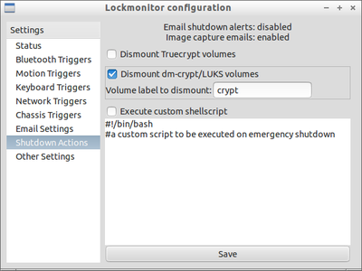

lockwatcher
===========

Anti live-forensics monitor program: watches for signs of tampering or forensic acquisition, purges encryption keys and shuts 
everything down.

It was thought up when writing a proof of concept for defeating live forensic analysis as part of a masters thesis
 that evaluated anti-forensic techniques.
 
Why?
=====
Operating systems have improved physical security over recent years (eg: by not allowing auto-run when 
the screen is locked) but even if they ignore a CD being inserted into the drive while the computer is locked, they
 are still sitting there happily allowing someone to keep trying to get your data. 
 
 This is bad. 
 
 lockwatcher is built around the assumption that if someone tries to use your computer while it is locked
 then they are trying to get your live data, so it needs to be destroyed.
 
*How lockwatcher works*

* You lock computer whenever not physically present at it.

* Interaction* with the computer while locked triggers an emergency shutdown.

* Encryption keys are purged from memory and the computer shuts down to help prevent live data from being acquired.

Caveats:
==========
The software was designed for running on live-CD/live-USB Linux, where dismounting (deniably) encrypted storage and 
powering down is accomplished in 3-5 seconds or less, with little warning given to the attacker. 
 
There is a Windows version but even forced shutdown is SLOW and obvious, and the difficulty in running it 
from ramdisk (live-USB,etc) means you are likely to have lots of interesting things on disk even if they can't 
get your RAM out in time.
 
It is specifically designed for defeating live memory acquisition.

It does not protect against disk analysis. That is what encryption is for, but lockwatcher will help keep your
keys safe.

It does not stop malicious software from stealing your data. Good information security practice will help, running 
a live distribution from read-only media will help and doing your sensitive stuff on a computer that does not 
talk to the internet will help but this is a big problem.

It offers very little protection from surveillance. Although it can be configured to save (or email) a photo of
an intruder in the room, this isn't an insurmountable obstacle to someone who wants to use cameras, microphones, 
RF monitoring equipment and so on.

It does not protect you from having someone beat you with a wrench (or threaten prison time) to get your 
encryption keys. Deniable encryption might help, but using it effectively requires a lot of diligence.

There can be false positives. A device failing or a cat walking around the room can scare the system into 
shutting down. By default a shutdown isn't very destructive, so this should only be a nuisance if it happens.

*What kind of 'Interaction' are we talking about?
=============
There are lots of triggers for an emergency shutdown which can be tailored for the environment 
the computer is running in.

* Device monitoring

Any devices or disks being plugged into the system or removed. USB, Firewire, CDs, etc.

* Keyboard kill-switch

One or more keyboard keys can be set to trigger an emergency shutdown if you are at the computer when it is required.

* Network interface monitoring

If the standard procedure of isolating the computer from the network is followed, or an attacker connects/disconnects
a network interface to access traffic then lockwatcher will notice this and trigger a shutdown.

* Bluetooth monitoring

lockwatcher can connect to a Bluetooth device and trigger a shutdown if this connection is severed. This is useful 
if your devices are removed, turned off or placed in a shielded container by an attacker. If you have a device which
 can be quickly turned off or parted from its batteries then this becomes a handy portable kill-switch when you are 
 not at the computer.
 
* RAM temperature detection

The first defence against RAM acquisition by freezing/removing memory modules 
(see: https://citp.princeton.edu/research/memory/), Lockwatcher can monitor the temperature of certain memory 
modules and trigger if their temperature falls below a certain point.

The availability of memory modules with temperature sensors is bad so at the moment lockwatcher only
supports monitoring Crucial Ballistix modules, and only on Windows (requires installing the Ballistix MOD utility).
Anyone who would like to contribute code to read temperature directly and from other types of RAM (like 
HWMonitor does) would be appreciated.

* Chassis movement detection

A much better defence against RAM acquisition, but fiddly to set up and requires some hardware.

You need a webcam. A £5 no-brand horror will be fine but one without a microphone or a microphone you have 
disabled would be a good idea for obvious reasons. The camera or inside of your case should also have an LED or two 
to give the case a bit of light inside.

Now the tricky bit: Suspend it in the computer case so it can swing freely. Use tape, string, whatever: just make sure
 the camera is free to swing a little when the case itself is moved. It also needs to be plugged in to USB, 
 preferably to an internal USB port.
 
 
 
If the case is securely shut (preferably with a lock) then any movement of the case or attempts to open it up will
 either move the camera or change the lighting conditions in the chassis, triggering a shutdown long before the
 RAM or BIOS can be tampered with. This also helps prevent hot-plug attacks against self-encrypting hard drives.

This trigger (and the one below) requires some free motion detection software: motion on Linux, iSpy on Windows. 

* Room movement detection

A camera can be pointed at the room to shut down when any motion is detected. Not too useful if pets/family/coworkers
 are expected to be in the same room as the computer while you are away.
 
This trigger can be activated and deactivated remotely so the system doesn't shutdown 
whenever you return to the computer. 

This also allows a photo to be saved or emailed to alert you to the identity of the attacker.

* Not yet implemented - Intrusion switch monitoring

Trigger a shutdown if the case is opened and the motherboard intrusion detection switch is activated. 

* Not yet implemented - Power supply monitoring

The room motion trigger could in theory be circumvented by cutting power to the room and then taking the memory
 modules. If the case is reasonably secure then there is minimal chance of this being successful, but a transition 
 from mains power to uninterruptable power supply could be used as a trigger. And cause false positives in a 
 power outage.

Bonus points
===============
Anything that increases the time between trigger activation and having your memory ripped out is helpful. Keep your system chassis secure, and tucked away so that doing anything with it requires moving it around and setting off the chassis motion monitor.

Password protect your BIOS to stop someone rebooting straight into a memory analysis CD. 

If your BIOS can be configured to perform a complete memory check on start up, (or even better to wipe memory) then activate those options. Yes it will require a password every time your system boots up and slow the process down, but some level of inconvenience has to be accepted.

Not important, but If your cables allow it you can swap the reset and power switch pins on the motherboard. An attempt to use the reset button to do a hard reset will trigger a standard shutdown instead, which causes Truecrypt to dismount its volumes. 

Linux Installation
================
These packages are required
* sudo apt-get install motion ifplugd lm-sensors 

* Install Imapclient (https://pypi.python.org/pypi/IMAPClient/0.10.2) by whatever method is convenient 

* [download/unzip lockwatcher]

Initial configuration:
* sudo setupfiles/setup.sh

To configure further via GUI:
* sudo src/lockwatcher-gui/lockwatcher-gui.py

sudo src/lockwatcher.py start

Windows Installation
================
*The free, open-source iSpy software is required for room and chassis motion detection

Get it here: http://www.ispyconnect.com/download.aspx
Install it, configure your cameras (covered later).

* Install lockwatcher from the msi, or just extract the .zip somewhere
* Run lockwatcher.exe, play with the settings
* Click 'Start lockwatcher' on the status panel

Using remote control
====================
(I know this is a pain in the neck, hopefully a native app will be up and running for iOS and Android at some point)
You need an email account with smtp and imap access, preferably a throwaway account that you don't use for anything else.

* Install QPython on your Android device

* Go to http://qpython.com/create.php, paste in the mobilecontrol.py code

* Edit emails,password to your liking and add the authentication secret from the Lockwatcher email settings tab

* Generate the QRCode on the web page, scan it with QPython on your phone

* Save it as a script
 
* Whenever you want to use it, open QPython and execute the script

Q&A
============
Q.Can lockwatcher wipe files instead of just shutting down? 

A.You can add relevant commands to the custom batch script which will be executed on emergency shutdown, but it takes a long time and makes false positive triggers a much bigger problem.

Q.Curse you authoritarian pigdog fascist, I want to use your stuff but it is riddled with government backdoors!

A. You can go through the source code if you want, most of it is written in Python 3 so it isn't even 
compiled on Linux. The lack of Windows access to Bluetooth sockets (with Python 3, try it if you don't believe me) 
and user defined Signals means a bit of C code is in the Win32 distribution as little executables, 
which is what Avast flags as suspicious occasionally. They are easy to compile with cygwin.

Q.When is the Mac version coming out?

A.Either when someone else writes one or when someone buys me a Mac to develop/test it on.

To-do list
===========
* Write iOS/Android apps instead of doing the qpython thing

* RAM temperature monitoring on Linux. My motherboard won't play nice with decode-dimms and 
I haven't had much luck doing what the ballistix MOD utility does. 
Also: other types of RAM on both operating systems.

* Testing and better install configurations for other linux distros

* I'm not happy with the Windows shutdown speed at all, it might be worth implementing RAM erasing instead.
I can't get firewire attacks to work on Window 7 so whether the shutdown process interrupts 
RAM acquisition in time or not is a mystery.

* If anyone could write something like this for Android/iOS/etc then please do. The exposure of mobile devices to 
seizure and acquisition at borders or on arrest, plus their critical reliance on a tiny stable of acquisition tools
 makes them the most deserving hosts of this kind of tool. Storage wiping would even be handy, but I don't know 
if it can be done without jailbreaking at the very least.
